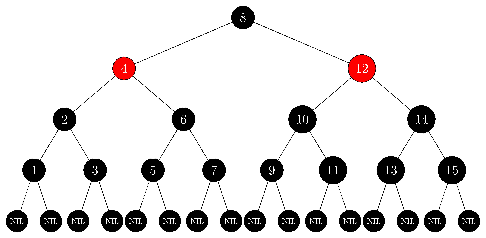
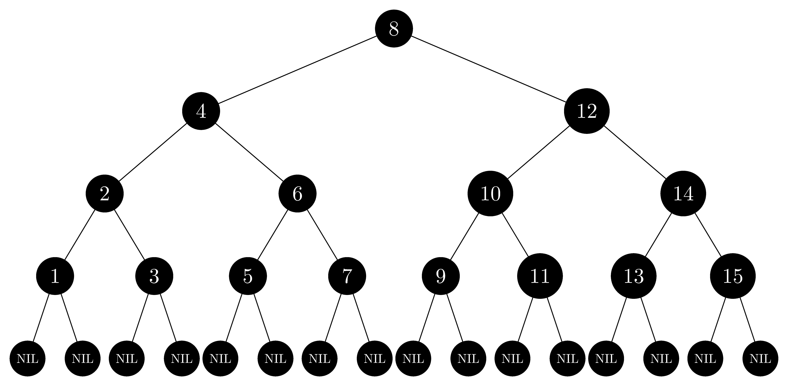

## 13.1-1

> In the style of Figure 13.1(a), draw the complete binary search tree of height $3$ on the keys $\\{1, 2, \ldots, 15\\}$. Add the $\text{NIL}$ leaves and color the nodes in three different ways such that the black-heights of the resulting red-black trees are $2$, $3$, and $4$.

- Complete binary tree of $height = 3$:

    

- Red-black tree of $black\text-heights = 2$:

    

- Red-black tree of $black\text-heights = 3$:

    

- Red-black tree of $black\text-heights = 4$:

    

## 13.1-2

> Draw the red-black tree that results after $\text{TREE-INSERT}$ is called on the tree in Figure 13.1 with key $36$. If the inserted node is colored red, is the resulting tree a red-black tree? What if it is colored black?

- If the inserted node is colored red, the tree doesn't satisfy property 4 because $35$ will be the parent of $36$, which is also colored red.
- If the inserted node is colored black, the tree doesn't satisfy property 5 because there will be two paths from node $38$ to $T.nil$ which contain different numbers of black nodes. 

We don't draw the *wrong* red-black tree; however, we draw the adjusted correct tree:

## 13.1-3

> Let us define a ***relaxed red-black tree*** as a binary search tree that satisfies red-black properties 1, 3, 4, and 5. In other words, the root may be either red or black. Consider a relaxed red-black tree $T$ whose root is red. If we color the root of $T$ black but make no other changes to $T$, is the resulting tree a red-black tree?

If we color the root of a relaxed red-black tree black but make no other changes, the resulting tree is a red-black tree. Not even any black-heights change.

## 13.1-4

> Suppose that we "absorb" every red node in a red-black tree into its black parent, so that the children of the red node become children of the black parent. (Ignore what happens to the keys.) What are the possible degrees of a black node after all its red children are absorbed? What can you say about the depths of the leaves of the resulting tree?

After absorbing each red node into its black parent, the degree of each node black node is

- $2$, if both children were already black,
- $3$, if one child was black and one was red, or
- $4$, if both children were red.

All leaves of the resulting tree have the same depth.

## 13.1-5

> Show that the longest simple path from a node $x$ in a red-black tree to a descendant leaf has length at most twice that of the shortest simple path from node $x$ to a descendant leaf.

In the longest path, at least every other node is black. In the shortest path, at most every node is black. Since the two paths contain equal numbers of black nodes, the length of the longest path is at most twice the length of the shortest path.

We can say this more precisely, as follows:

Since every path contains $\text{bh}(x)$ black nodes, even the shortest path from $x$ to a descendant leaf has length at least $\text{bh}(x)$. By definition, the longest path from $x$ to a descendant leaf has length $\text{height}(x)$. Since the longest path has $\text{bh}(x)$ black nodes and at least half the nodes on the longest path are black (by property 4), $\text{bh}(x) \ge \text{height}(x) / 2$, so

length of longest path $= \text{height}(x) \le 2 \cdot \text{bh}(x) \le$ twice length of shortest path.

## 13.1-6

> What is the largest possible number of internal nodes in a red-black tree with black-height $k$? What is the smallest possible number?

- The largest is a path with half black nodes and half red nodes, which has $2^{2k} - 1$ internal nodes.
- The smallest is a path with all black nodes, which has $2^k - 1$ internal nodes.

## 13.1-7

> Describe a red-black tree on $n$ keys that realizes the largest possible ratio of red internal nodes to black internal nodes. What is this ratio? What tree has the smallest possible ratio, and what is the ratio?

- The largest ratio is $2$, each black node has two red children.
- The smallest ratio is $0$.
